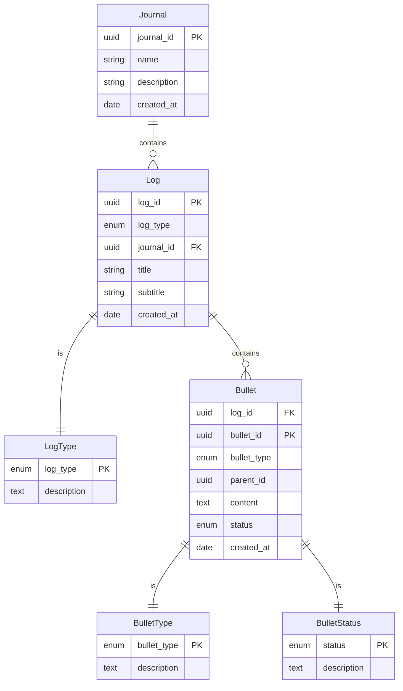

# Bullet Journal

## What is Bullet Journal?

A Bullet Journal is a flexible and personalized note-taking system created by Ryder Carroll. It combines the functions of a calendar, to-do list, diary, and notebook to help users better organize and manage their daily lives. The Bullet Journal is primarily composed of the following sections: 

### Index 
This is the table of contents for the Bullet Journal, used to record the content and page numbers of each section for easy reference. 

### Future Log 
This section is used to record important events and plans for the upcoming months, helping users to plan ahead. 

### Monthly Log 
At the beginning of each month, a monthly log page is created to record important events, goals, and tasks for the month. 

### Daily Log 
This is the core part of the Bullet Journal, used to record daily tasks, events, and notes. Each entry in the daily log is categorized into several types: 
- **Tasks**: Represented by a dot (•), these are the to-do items that need to be completed. 
- **Completed Tasks**: Represented by an "X", these are the tasks that have been completed. 
- **Events**: Represented by a circle (○), these are events that have occurred or are scheduled to occur. 
- **Notes**: Represented by a dash (—), these are notes or ideas that need to be recorded. 
  
### Custom Pages 
Based on individual needs, various custom pages can be added, such as goal setting, habit tracking, book lists, movie lists, etc. The flexibility of this system allows each person to design and use their Bullet Journal according to their own needs and preferences, thereby improving productivity and quality of life.

---

## Entity

